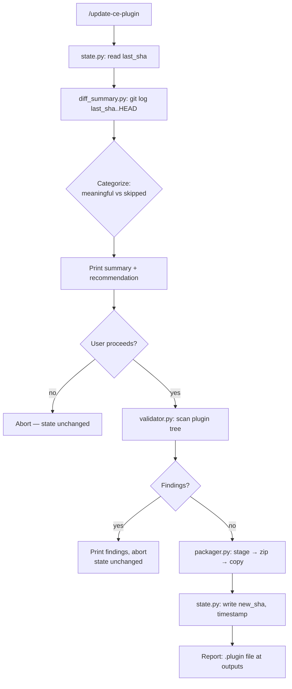

# Cowork-Side Sync Tool for Compound-Engineering Plugin

## Overview

Build a small Cowork plugin — distinct from the CE Claude Code plugin itself — that Danielle invokes in Cowork to rebuild her local Cowork copy of `compound-engineering` whenever meaningful upstream changes land in the CE repo. The plugin exposes one skill (`/update-ce-plugin`) that reads the local CE clone, summarizes meaningful upstream changes since the last successful rebuild, pre-validates against known Cowork failure modes, and produces a fresh `.plugin` file Danielle reinstalls through the Cowork UI.

This is a personal sync layer for one user on one machine. It is **not** a CE-repo contribution, **not** a generic Claude Code → Cowork converter, and **not** an upstream target in `src/targets/`.

## Problem Frame

Danielle works in Cowork, not Claude Code, but uses the `compound-engineering` plugin's skills heavily. Yesterday's manual rebuild failed silently because `plugins/compound-engineering/skills/ce-release-notes/SKILL.md` line 3 contains `<skill-name>` in its description, and Cowork's validator treats that substring as malformed HTML. The failure banner read "Plugin validation failed" with no file, line, or rule surfaced. One string broke 94 skills+agents.

The sync tool replaces Danielle's current manual process (hand-zip the plugin, hope nothing's broken, find out in the Cowork UI if it is) with a reproducible workflow that catches yesterday's known failure mode — plus adjacent silent-failure modes — before producing any output.

## Requirements Trace

Carried forward from origin document (see origin: `docs/brainstorms/2026-04-19-cowork-ce-plugin-sync-requirements.md`):

- R1. Tool is a Cowork plugin, installed once, exposing a manually-invoked skill (e.g., `/update-ce-plugin`).
- R2. Reads local CE clone; does not `git fetch`/`git pull` on its own.
- R3. Source path is configurable.
- R4. Compares current state to last successful rebuild's commit SHA; first run is treated as a fresh build.
- R5. Categorizes changes into meaningful vs. not-meaningful per the path rules in the origin doc.
- R6. Prints diff summary with commit subjects for meaningful changes, count for skipped, and a recommendation.
- R7. User can override recommendation.
- R8. Validation blocks output on findings; no partial output.
- R9. Validates angle-bracket patterns in descriptions, YAML frontmatter sanity, and no cross-skill path refs.
- R10. No auto-fix default.
- R11. Hand-rolled, self-contained, no bun/CE-CLI dependency.
- R12. Outputs `.plugin` file to workspace folder; manual UI reinstall.
- R13. Updates stored SHA on success.
- R14. State is a single SHA + timestamp.
- R15. Single-user scope.

## Scope Boundaries

- No CE-repo modifications (no `src/targets/cowork.ts`).
- No automatic sync, scheduled tasks, or file watchers.
- No auto-fix of validation findings.
- No preservation of local Cowork plugin edits across reinstall.
- Not a generic converter; specific to the CE plugin's shape.
- No GitHub pulls — Danielle runs `git pull` manually.

### Deferred to Separate Tasks

- **Post-install Cowork validator probe.** Once the first successful build lands, run a short investigation to see whether Cowork has other validation rules beyond the angle-bracket one (R9 deferred question). Outcome may produce a follow-up plan to extend the validator. Tracked here rather than blocking this plan.
- **Publishing the tool.** If Danielle later decides to share the sync plugin with others at Every, a follow-up task would cover name/namespace generalization and documentation. Out of scope for v1.

## Context & Research

### Relevant Code and Patterns

- **`plugins/compound-engineering/` structure** — the authoritative source the converter reads. Contains `.claude-plugin/plugin.json`, `skills/*/SKILL.md`, `agents/{design,docs,document-review,research,review,workflow}/*.md`, `README.md`, `CHANGELOG.md`, `AGENTS.md`, `CLAUDE.md`, `LICENSE`. No `.mcp.json` or `hooks/` today.
- **`.claude-plugin/plugin.json`** — manifest shape (`name`, `version`, `description`, `author`, `homepage`, `repository`, `license`, `keywords`). Same schema used by Cowork.
- **`cowork-plugin-management:create-cowork-plugin` skill** — documents the `.plugin` packaging command (`zip -r /tmp/<name>.plugin . -x "*.DS_Store"`) and outputs-folder delivery convention. Primary reference for packaging behavior.
- **SKILL.md frontmatter shape** — YAML block between `---` markers, with `name`, `description` required and other optional fields. Body is markdown.
- **Agent `.md` shape** — same frontmatter+markdown pattern, located under categorized subdirectories.

### Institutional Learnings

- `docs/solutions/plugin-versioning-requirements.md` — counts in `plugin.json`/`marketplace.json` vs. actual file counts. Pattern adapted as a cheap structural check in the validator (an optional tripwire if metadata drifts from reality).
- `docs/solutions/skill-design/pass-paths-not-content-to-subagents-2026-03-26.md` — informs script design: the validator walks paths and reads only when validating, avoiding loading all 93 skill bodies at once.
- **Gaps explicitly noted:** no prior doc covers angle-bracket HTML-like patterns in descriptions, YAML frontmatter edge cases, or cross-skill path refs. This plan pioneers those checks; they're worth documenting in `docs/solutions/integrations/` after first successful run.

### External References

- Cowork plugin architecture reference: bundled `create-cowork-plugin/SKILL.md` (loaded during research).
- Claude Code plugin system shares schema with Cowork; no external docs fetch was required.

## Key Technical Decisions

- **Python 3 as the scripting language.** Preinstalled in the Cowork sandbox, PyYAML handles frontmatter cleanly, `subprocess` is ergonomic for git calls, no build step. Bash rejected (YAML parsing too painful); Bun rejected (not guaranteed in Cowork sandbox); Node rejected (npm install adds ceremony without a corresponding win).
- **Self-contained scripts under `scripts/`.** The Cowork plugin ships its own Python modules. No import of CE-repo code; no bun dependency. If a particular parsing edge case later needs the upstream parser, cribbing a single function is cheaper than integrating a CLI.
- **Git-SHA state, not full snapshots.** A single JSON file (`state.json`) inside the Cowork plugin's own directory holds `last_sha`, `last_rebuilt_at`, and the source path. `git log <sha>..HEAD` against the CE repo supplies the diff.
- **Path-pattern categorization for meaningful changes.** Categorize by file path prefix rather than parsing skill bodies. Fast, deterministic, easy to tune. The category table is a constant in `diff_summary.py`.
- **Block-and-surface validator, no auto-fix in v1.** Matches the origin doc decision. The validator returns a list of findings with file, line, rule, and hint; the orchestration skill prints them and aborts. A future `--auto-fix` flag stays out of scope.
- **`.plugin` is a plain zip** (confirmed from `create-cowork-plugin/SKILL.md`). Staging to `/tmp` avoids permissions issues, then copy to the Cowork workspace folder.
- **Plugin name: `ce-cowork-sync`.** Keeps it short, distinct from `compound-engineering`, and clearly describes the purpose. Invocation via `/update-ce-plugin`.
- **No modifications to CE plugin content during conversion.** The CE plugin's files are valid Cowork plugin files as-is (schema is shared). Converter is effectively a validate-then-zip pipeline; no rewriting. This keeps the tool from carrying a translation surface that could drift from upstream.

## Open Questions

### Resolved During Planning

- **Language choice** — Python 3.
- **"Meaningful" detection** — path-prefix categorization, not body parsing. Simple globs for skipped paths (`src/`, `tests/`, `docs/`, `README.md`, `CHANGELOG.md`, `LICENSE`, `package.json`, `bun.lock`, `tsconfig.json`, `scripts/release/`, `.github/`, `plugins/coding-tutor/`); everything else under `plugins/compound-engineering/` is meaningful.
- **`.plugin` format** — zip, confirmed.
- **Where the sync plugin source lives** — recommend a dedicated folder `ce-cowork-sync/` in Danielle's Cowork workspace (e.g., `/sessions/bold-epic-fermi/mnt/Compound Engineering/ce-cowork-sync/` or wherever she prefers within her workspace). Danielle makes the final pick at Unit 1.

### Deferred to Implementation

- Exact regex for the angle-bracket scanner — needs to balance false positives (markdown links `[text](url)`, backtick code) with catching the real cases. Will refine as Unit 4 implementation reveals edge cases.
- Cowork's outputs-directory convention on Danielle's machine. The Cowork system prompt shows `/sessions/<session>/mnt/<workspace>`; the packager should write to whichever workspace folder Danielle selected when running the skill. Concrete path resolution is an implementation-time detail.
- **Whether Cowork has other validation rules beyond angle-brackets.** Planned as a post-v1 investigation (see Deferred to Separate Tasks). May add validator checks later.

## Output Structure

The sync plugin directory layout:

```
ce-cowork-sync/
├── .claude-plugin/
│   └── plugin.json              # Manifest (name: ce-cowork-sync, version: 0.1.0)
├── skills/
│   └── update-ce-plugin/
│       └── SKILL.md             # Orchestration skill (invoked as /update-ce-plugin)
├── scripts/
│   ├── state.py                 # Read/write last-rebuilt SHA + timestamp
│   ├── diff_summary.py          # Git diff → categorize → summarize → recommend
│   ├── validator.py             # Pre-flight: angle-brackets, YAML, cross-skill refs
│   └── packager.py              # Stage → zip → deliver → update state
├── state.json                   # Runtime state (gitignored in the source repo)
└── README.md                    # How to install and use
```

A `.plugin` file — `ce-cowork-sync.plugin` — is the distributable unit (Danielle zips and installs once into Cowork; after that, invocations run against the installed copy).

## High-Level Technical Design

> *This illustrates the intended approach and is directional guidance for review, not implementation specification. The implementing agent should treat it as context, not code to reproduce.*



The skill (`SKILL.md`) orchestrates this as a linear narrative with one user-confirmation pause (between `R` and `V`). Scripts are independently runnable for debugging (`python3 scripts/validator.py <path-to-ce-repo>` prints findings and exits).

## Implementation Units

- [ ] **Unit 1: Scaffold the Cowork plugin container**

**Goal:** Create the empty `ce-cowork-sync/` plugin directory with a valid manifest and an empty skill stub, so subsequent units have a place to write files.

**Requirements:** R1, R11

**Dependencies:** None.

**Files:**
- Create: `ce-cowork-sync/.claude-plugin/plugin.json`
- Create: `ce-cowork-sync/skills/update-ce-plugin/SKILL.md` (stub body; filled in Unit 6)
- Create: `ce-cowork-sync/README.md` (install + invocation instructions)
- Create: `ce-cowork-sync/.gitignore` (ignore `state.json`)

**Approach:**
- `plugin.json` fields: `name: ce-cowork-sync`, `version: 0.1.0`, `description` (plain text, no angle-bracket patterns — the tool's own manifest must pass its own validator), `author` with Danielle's info.
- `SKILL.md` stub has valid frontmatter (`name: update-ce-plugin`, concise `description`) and a placeholder body noting "implemented in Unit 6."
- `README.md` covers: what this plugin does, how to install once (zip directory → install `.plugin` in Cowork), how to configure the source path on first run, how to invoke.
- Confirm the final directory location with Danielle at the start of this unit (recommendation: somewhere inside her Cowork workspace so it's visible in the Cowork UI; dedicated folder, not a subfolder of the CE repo clone).

**Patterns to follow:**
- Plugin manifest shape from `plugins/compound-engineering/.claude-plugin/plugin.json`.
- SKILL.md frontmatter shape from any existing CE skill (e.g., `plugins/compound-engineering/skills/ce-brainstorm/SKILL.md`).

**Test scenarios:**
- Happy path: Running `python3 -c "import json; json.load(open('ce-cowork-sync/.claude-plugin/plugin.json'))"` succeeds and prints the `name` field.
- Happy path: The `ce-cowork-sync.plugin` zip, manually created from this scaffold, installs successfully in Cowork (invocation does nothing yet but the install validates).
- Edge case: The scaffold's own `plugin.json` and `SKILL.md` pass the validator implemented in Unit 4 (self-dogfooding — the tool validates its own manifest).

**Verification:**
- Cowork accepts the zipped scaffold without validation errors.
- `update-ce-plugin` skill is discoverable in Cowork after install (even though it does nothing yet).

- [ ] **Unit 2: State management module (`scripts/state.py`)**

**Goal:** Provide read/write of last-rebuilt SHA and timestamp, plus the user-configured source path.

**Requirements:** R2, R3, R4, R13, R14

**Dependencies:** Unit 1 (scaffold).

**Files:**
- Create: `ce-cowork-sync/scripts/state.py`
- Create: `ce-cowork-sync/tests/test_state.py`

**Approach:**
- Two public functions: `read_state(plugin_root: Path) -> dict` and `write_state(plugin_root: Path, **updates) -> None`.
- `state.json` schema: `{"source_path": str, "last_sha": str | None, "last_rebuilt_at": str | None}`. Source path is set on first-run config; `last_sha`/`last_rebuilt_at` stay `None` until the first successful rebuild.
- `read_state` returns a dict with defaults applied; `write_state` merges and writes atomically (write temp file, rename — avoids corruption on interrupted writes).
- If `source_path` is `None`, the orchestration skill prompts the user for it and calls `write_state(source_path=...)`.

**Patterns to follow:**
- Stdlib only (`json`, `pathlib`, `datetime`). No third-party deps.

**Test scenarios:**
- Happy path: `read_state` on a plugin dir with no `state.json` returns `{"source_path": None, "last_sha": None, "last_rebuilt_at": None}`.
- Happy path: `write_state(source_path="/path/to/repo")` followed by `read_state` returns the written value.
- Happy path: `write_state(last_sha="abc123", last_rebuilt_at="2026-04-19T12:00:00Z")` preserves a previously-written `source_path`.
- Edge case: Malformed `state.json` (hand-edited garbage) causes `read_state` to raise a clear error with the file path — not a silent fallback (to avoid masking data corruption).
- Edge case: Atomic write survives an interrupt during `write_state` — the old file remains intact, not truncated.

**Verification:**
- `python3 -m pytest tests/test_state.py` passes.
- Manual smoke: set a source path, kill the process mid-write, confirm the existing state file is still valid JSON.

- [ ] **Unit 3: Diff summary module (`scripts/diff_summary.py`)**

**Goal:** Given a source-path CE repo and a prior SHA, compute a categorized diff and produce a human-readable summary with a rebuild recommendation.

**Requirements:** R4, R5, R6

**Dependencies:** Unit 2 (for state).

**Files:**
- Create: `ce-cowork-sync/scripts/diff_summary.py`
- Create: `ce-cowork-sync/tests/test_diff_summary.py`

**Approach:**
- Entry point: `summarize_diff(source_path: Path, last_sha: str | None) -> DiffSummary`.
- If `last_sha` is `None`, return a `DiffSummary` flagged `first_build=True` with no diff content.
- Otherwise run `git -C <source_path> log --pretty='%h %s' <last_sha>..HEAD -- plugins/compound-engineering/` to get meaningful-area commit subjects; run `git -C <source_path> diff --name-status <last_sha>..HEAD` to enumerate all changed files.
- Partition changed files into `meaningful` and `skipped` using a constant path-rule table:
  - `MEANINGFUL_PREFIXES = ["plugins/compound-engineering/skills/", "plugins/compound-engineering/agents/", "plugins/compound-engineering/commands/", "plugins/compound-engineering/.claude-plugin/"]`
  - `SKIPPED_PREFIXES = ["src/", "tests/", "docs/", ".github/", "plugins/coding-tutor/", "scripts/release/"]`
  - `SKIPPED_ROOT_FILES = ["README.md", "CHANGELOG.md", "LICENSE", "package.json", "bun.lock", "tsconfig.json", "AGENTS.md", "CLAUDE.md"]`
  - Unknown paths default to skipped with a note (so a new top-level file doesn't trigger spurious rebuilds).
- For each meaningful file, classify further: added / removed / body-modified / description-modified. Description-modified is detected by cheap frontmatter diff (parse old and new YAML, compare `description` strings).
- Produce a summary string showing meaningful changes grouped (new skills, removed skills, modified skills, description changes, other meaningful), skipped count, and a recommendation (`"rebuild — N skills affected"` vs `"no meaningful changes since last rebuild"`).

**Patterns to follow:**
- Stdlib `subprocess.run(..., check=True, capture_output=True, text=True)` for git.
- Path categorization as a pure function over file paths (easily testable).

**Test scenarios:**
- Happy path: Given two commits with a skill body change in `plugins/compound-engineering/skills/ce-plan/SKILL.md`, the summary reports "1 skill modified: ce-plan" and recommends rebuild.
- Happy path: Given a new `plugins/compound-engineering/skills/ce-foo/SKILL.md`, the summary reports "+1 new skill: ce-foo".
- Happy path: Given only `README.md` changes, the summary reports "no meaningful changes since last rebuild".
- Edge case: Given only `src/targets/codex.ts` changes, the summary reports no meaningful changes (confirms skipped-prefix routing).
- Edge case: Given a description-only change (body unchanged), the summary distinguishes "description changed" from "body modified".
- Edge case: First-time build (`last_sha=None`) skips the diff section and returns a summary reading "first build — no prior state to compare".
- Error path: Source path is not a git repo — raises a clear error naming the path.
- Integration: The `last_sha` is not reachable from current `HEAD` (e.g., upstream force-pushed) — `git log` errors; the module surfaces the failure without claiming the diff is empty.

**Verification:**
- Unit tests pass using a temporary git repo fixture.
- Manual smoke: point at the real CE repo, verify the summary of recent commits looks right to Danielle.

- [ ] **Unit 4: Validator module (`scripts/validator.py`)**

**Goal:** Pre-flight check the CE plugin tree for known Cowork-breaking patterns. Return findings; do not modify files.

**Requirements:** R8, R9, R10

**Dependencies:** Unit 2 (state for source path).

**Files:**
- Create: `ce-cowork-sync/scripts/validator.py`
- Create: `ce-cowork-sync/tests/test_validator.py`
- Create: `ce-cowork-sync/tests/fixtures/` (small fixture plugin trees with known findings)

**Approach:**
- Entry point: `validate(plugin_root: Path) -> list[Finding]`. `plugin_root` is the CE plugin dir itself (i.e., `<source_path>/plugins/compound-engineering/`), not the whole CE repo.
- `Finding` shape: `{file: str, line: int | None, rule: str, message: str, hint: str}`.
- Three rule implementations, each run independently against every relevant file:
  1. **`angle_bracket_in_description`** — for each `.md` file with YAML frontmatter and for `plugin.json`, parse the description field (if present), and search for regex `<[/!]?[A-Za-z][^>]*>` in its raw text. Ignore content inside backticks in the description (a common legitimate escape). Line number = the line of the description field in the source file.
  2. **`yaml_frontmatter_valid`** — every `SKILL.md`, agent `.md`, and command `.md` must have a parseable YAML frontmatter block with non-empty `name` and `description`. Missing frontmatter, YAML parse errors, or empty required fields each produce a finding.
  3. **`no_cross_skill_paths`** — for every `SKILL.md` body, scan for path references that escape the skill's own directory: any `../` relative traversal and any absolute path pointing into another skill's dir. Use a conservative regex (capture tokens that look like file paths — `[\w\-./]+\.(md|yaml|yml|json|py|sh|ts|js)` — then filter by escape pattern). False positives are acceptable; false negatives are not — when unsure, flag.
- Findings list is empty on success. On findings, the caller (Unit 6 skill) prints them and aborts; the validator does not `sys.exit`.
- `python3 scripts/validator.py <plugin_root>` prints findings and exits non-zero if any, for CLI ergonomics during debugging.

**Execution note:** Write failing tests first for each of the three rules (angle-brackets, YAML, cross-skill paths), using fixtures that deliberately contain the known-broken patterns, then implement until green. The validator is the load-bearing safety rail; test-first ensures it actually catches yesterday's exact bug.

**Patterns to follow:**
- `pyyaml` for frontmatter parsing (install with `pip install pyyaml --break-system-packages` if missing in Cowork sandbox).
- Pass-paths-not-content pattern (per `docs/solutions/skill-design/pass-paths-not-content-to-subagents-2026-03-26.md`): walk the tree enumerating paths, then open each file once and run all applicable rules against it.

**Test scenarios:**
- Happy path (regression): Fixture reproducing line 3 of `ce-release-notes/SKILL.md` (literal `<skill-name>` in description) produces an `angle_bracket_in_description` finding with the correct file and line.
- Happy path: Fixture with clean descriptions produces zero findings.
- Edge case (angle-brackets): Description containing `` `<skill-name>` `` wrapped in backticks does NOT produce a finding.
- Edge case (angle-brackets): Description with `<` or `>` alone (not a tag pattern) does NOT produce a finding.
- Edge case (angle-brackets): Description with `<br/>`, `</div>`, `<TagName>` each produce findings.
- Happy path (YAML): Fixture with missing `description` field produces a `yaml_frontmatter_valid` finding.
- Error path (YAML): Fixture with malformed YAML (unclosed quote) produces a `yaml_frontmatter_valid` finding naming the parse error.
- Happy path (cross-skill): Fixture SKILL.md referencing `../other-skill/references/foo.md` produces a `no_cross_skill_paths` finding.
- Edge case (cross-skill): SKILL.md referencing its own `references/foo.md` does NOT produce a finding.
- Integration: Running the validator against the actual current `plugins/compound-engineering/` tree produces exactly one finding (the `<skill-name>` in `ce-release-notes/SKILL.md` line 3) — confirms real-world regression coverage.

**Verification:**
- Unit tests pass.
- `python3 scripts/validator.py <path-to-real-ce-repo>/plugins/compound-engineering/` prints exactly the known `<skill-name>` finding with file, line, rule, and a hint like `"Wrap '<skill-name>' in backticks or rephrase."`

- [ ] **Unit 5: Packager module (`scripts/packager.py`)**

**Goal:** Given a validated source path, produce a `.plugin` zip file in Cowork's outputs folder and return the path. Update state on success.

**Requirements:** R11, R12, R13

**Dependencies:** Unit 2 (state), Unit 4 (validator must pass before packager runs).

**Files:**
- Create: `ce-cowork-sync/scripts/packager.py`
- Create: `ce-cowork-sync/tests/test_packager.py`

**Approach:**
- Entry point: `package(source_path: Path, output_dir: Path, plugin_root: Path) -> Path`. Returns the absolute path of the produced `.plugin` file.
- Stage: copy `<source_path>/plugins/compound-engineering/` into a temporary dir (e.g., `tempfile.mkdtemp(prefix="ce-cowork-stage-")`).
- Zip: `subprocess.run(["zip", "-r", "/tmp/compound-engineering.plugin", ".", "-x", "*.DS_Store"], cwd=staging_dir, check=True)`. Staging in `/tmp` avoids workspace permission issues per `create-cowork-plugin` guidance.
- Deliver: copy the `/tmp/*.plugin` to `<output_dir>/compound-engineering.plugin`. `output_dir` is resolved at runtime from Cowork's workspace (orchestration skill passes it in).
- Read the current HEAD SHA of the source repo (`git -C <source_path> rev-parse HEAD`) and call `state.write_state(last_sha=sha, last_rebuilt_at=iso_now)`.
- On any subprocess failure, raise cleanly without touching state — partial failure does not update `last_sha`.
- Cleanup the staging directory on success and on failure (use `finally`).

**Patterns to follow:**
- Staging-then-copy (not direct-write) per `create-cowork-plugin/SKILL.md` packaging convention.
- Stdlib `shutil`, `tempfile`, `subprocess`.

**Test scenarios:**
- Happy path: Given a toy plugin dir and a writable output dir, `package()` produces a `.plugin` file at the expected path and returns it.
- Happy path: The produced `.plugin` unzips to contain `.claude-plugin/plugin.json` at the root of the archive (not `plugins/compound-engineering/.claude-plugin/plugin.json`).
- Happy path: After successful packaging, `state.json` contains a non-empty `last_sha` matching the source repo's HEAD.
- Error path: If `zip` fails (simulate via stubbed subprocess), state is unchanged and the temp dir is cleaned up.
- Error path: If the source path doesn't contain `plugins/compound-engineering/`, the packager errors clearly (not silently packaging an empty plugin).
- Integration: The real `.plugin` produced from the actual CE repo installs successfully in Cowork (manual verification at the end of this unit).

**Verification:**
- Unit tests pass.
- Manual: install the produced `.plugin` into Cowork and confirm all CE skills are available and invocable.

- [ ] **Unit 6: Skill orchestration (`skills/update-ce-plugin/SKILL.md`)**

**Goal:** Tie state, diff, validator, and packager into one user-facing workflow with one confirmation pause. This is the entry point Danielle invokes.

**Requirements:** R1, R6, R7, R8, R12

**Dependencies:** Units 2–5.

**Files:**
- Modify: `ce-cowork-sync/skills/update-ce-plugin/SKILL.md` (flesh out the stub from Unit 1).

**Approach:**
- Frontmatter description is concise and uses **no angle-bracket patterns** (self-dogfooding: the tool's own skill would fail its own validator otherwise). Trigger phrases: "update ce plugin", "rebuild compound-engineering", "sync ce-cowork".
- Body walks through the flow as instructions for Claude (per `create-cowork-plugin` guidance: skill bodies are directives for Claude, not user-facing prose):
  1. Read state via `python3 scripts/state.py --read`. If `source_path` is null, ask the user for the CE repo path and write it back.
  2. Ensure `source_path` contains `.git/` and `plugins/compound-engineering/`; abort with a clear error otherwise.
  3. Warn if the repo has uncommitted changes (`git status --porcelain`) — proceed only after explicit confirmation, since uncommitted edits will ship in the `.plugin`.
  4. Run `python3 scripts/diff_summary.py <source_path> <last_sha>`; print its output; ask the user whether to proceed with the rebuild. Honor any override regardless of the recommendation (R7).
  5. Run `python3 scripts/validator.py <source_path>/plugins/compound-engineering`; on non-empty findings, print them and abort without touching state or producing output.
  6. Resolve the Cowork outputs dir (use the workspace folder Danielle is currently in — falls back to asking if ambiguous).
  7. Run `python3 scripts/packager.py <source_path> <output_dir>`; on success, display a `computer://` link to the produced `.plugin` and a one-line install reminder ("Drag this into Cowork to install").
  8. On any abort path (user declines diff, validator finds issues, packaging fails), state is unchanged — next invocation diffs against the same `last_sha` as before.
- Include a short "how this works" section in the body so Danielle can self-serve if something goes wrong.

**Patterns to follow:**
- SKILL.md body style from `plugins/compound-engineering/skills/ce-brainstorm/SKILL.md` (imperative, for-Claude instructions).
- `create-cowork-plugin` skill's packaging conventions for the output step.

**Test scenarios:**
- Happy path (first run): State file absent → skill prompts for source path → proceeds through validator → produces `.plugin` → state is populated.
- Happy path (subsequent run, meaningful changes): Diff summary shows meaningful changes; user confirms; validator passes; `.plugin` produced; state SHA advances.
- Happy path (no changes): Diff summary reports no meaningful changes since last rebuild; user can still override and proceed if desired.
- Error path (validator fails): Validator returns the `<skill-name>` finding; skill prints it and aborts; state SHA unchanged; no `.plugin` produced.
- Error path (uncommitted changes): Skill warns and requires explicit confirmation before proceeding.
- Error path (source path invalid): Skill errors clearly and writes nothing.
- Integration: End-to-end against the real current state of the CE repo — skill runs, validator catches the `<skill-name>` bug, and aborts cleanly. After manually fixing `ce-release-notes/SKILL.md` (wrapping the token in backticks on a throwaway branch), re-running produces a valid `.plugin` that installs in Cowork.

**Verification:**
- The real end-to-end flow works: fresh install of the sync plugin → point at real CE repo → validator reports the known bug → fix locally → re-run → `.plugin` produced → installed in Cowork → all 43 CE skills invocable from Cowork.

## System-Wide Impact

- **Interaction graph:** The Cowork sync plugin is installed alongside the CE plugin itself in Cowork. Invoking `/update-ce-plugin` does not interact with any other installed Cowork plugin. The sync plugin reads the CE Claude Code repo via the Cowork sandbox's Bash tool.
- **Error propagation:** Subprocess failures (git, zip, python) surface as orchestration-level errors that abort cleanly. State is only written after successful packaging — no partial progress.
- **State lifecycle risks:** `state.json` is the single source of truth for "what SHA did we last build." Atomic-write behavior in Unit 2 prevents corruption on interrupted runs. If the user hand-edits or deletes the state file, next invocation treats the run as a first build (full rebuild, no diff).
- **API surface parity:** None — this is a self-contained personal tool. No other surfaces depend on its outputs.
- **Integration coverage:** The final integration test (Unit 6 verification) exercises the full chain: real CE repo → real validator → real zip → real Cowork install. This is the only coverage that proves the tool actually solves yesterday's failure.
- **Unchanged invariants:** The CE repo is read-only from the sync tool's perspective. No files in `plugins/compound-engineering/` or the CE repo root are modified. The `.plugin` output is content-identical to `plugins/compound-engineering/` (plus `.claude-plugin/` at the archive root), not a rewritten derivative.

## Risks & Dependencies

| Risk | Mitigation |
|------|------------|
| Cowork has additional validation rules beyond angle-brackets, not yet discovered, and a rebuild fails silently again. | Validator is deliberately extensible — adding a new rule is a ~20-line addition. Deferred task to probe Cowork's validator post-v1 documents any new rules. Until then, surface failures with full context so Danielle can diagnose quickly. |
| The angle-bracket regex produces false positives (e.g., legitimate description text that looks HTML-ish). | Rule 1 ignores backtick-wrapped content. If false positives show up, the rule is one regex to tune, and the blast radius is one skill's description per false positive. Better than false-negatives (which is yesterday's bug). |
| PyYAML isn't preinstalled in the Cowork sandbox. | Document `pip install pyyaml --break-system-packages` in Unit 1's README. Alternately, use `ruamel.yaml` or a vendored pure-Python YAML parser; PyYAML is the conventional default. |
| The CE repo restructures (e.g., moves skills to a new path) upstream. | The path-prefix categorization table in `diff_summary.py` is a single constant. Restructuring requires updating the table. Catch this early by running integration test Unit 6 quarterly. |
| State file corruption (partial write during power loss). | Unit 2's atomic write (temp file + rename) handles this. Worst case, delete `state.json` and treat next run as a first build. |
| `zip` command unavailable in Cowork sandbox. | `zip` is preinstalled in Cowork's Ubuntu 22 sandbox. If missing, fall back to Python's `zipfile` stdlib — straightforward substitution. |
| Cowork workspace path changes between sessions. | Skill resolves `output_dir` at runtime from the current workspace, not from state. If Danielle moves to a different workspace, next invocation picks up the new one. |

## Documentation / Operational Notes

- Create `docs/solutions/integrations/cowork-description-html-parsing-2026-04-19.md` after first successful run, documenting the angle-bracket failure mode Danielle hit, the validator's regex, and any Cowork-platform-side bug-report status. Fills the "no prior doc" gap the learnings researcher flagged.
- Consider opening an upstream CE issue (separate task) for the `<skill-name>` in `ce-release-notes/SKILL.md` — fixing it upstream avoids the validator finding entirely, benefits other Cowork users, and is a one-backtick change.
- `README.md` in the sync plugin covers: install (zip → drag into Cowork), first-run configuration (source path prompt), subsequent invocations, how to read the diff summary, what to do when the validator blocks.

## Sources & References

- **Origin document:** [docs/brainstorms/2026-04-19-cowork-ce-plugin-sync-requirements.md](docs/brainstorms/2026-04-19-cowork-ce-plugin-sync-requirements.md)
- **Cowork plugin format:** `cowork-plugin-management:create-cowork-plugin` skill — packaging command, manifest schema, component types.
- **Angle-bracket bug source:** `plugins/compound-engineering/skills/ce-release-notes/SKILL.md:3`
- **Plugin manifest reference:** `plugins/compound-engineering/.claude-plugin/plugin.json`
- **Institutional learnings:**
  - `docs/solutions/plugin-versioning-requirements.md` (counts-vs-reality validation pattern, inspiration for optional tripwire)
  - `docs/solutions/skill-design/pass-paths-not-content-to-subagents-2026-03-26.md` (scanner design)
- **AGENTS.md rule:** "File References in Skills" section — basis for cross-skill path rule in validator.
